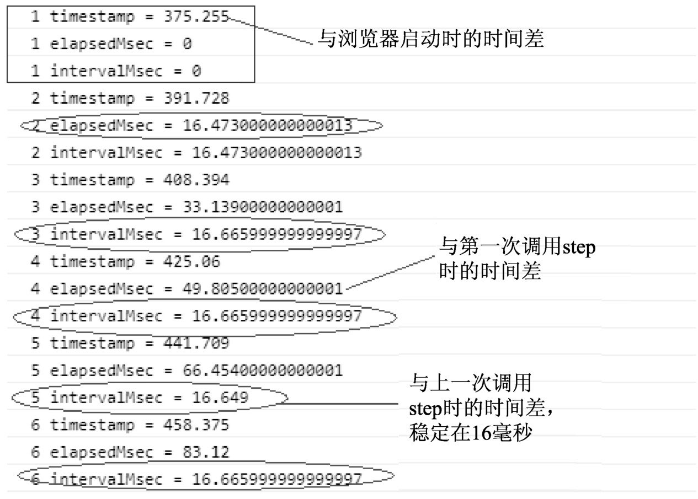

#### 关于 requestAnimationFrame 动画的统计

```ts
// start记录的是第一次调用step函数的时间点，用于计算与第一次调用step函数的时间差，以毫秒为单位;
let start: number = 0;
//lastTime记录的是上一次调用step函数的时间点，用于计算两帧之间的时间差，以毫秒为单位
let lastTime: number = 0;
// count用于记录step函数运行的次数
let count: number = 0;
// step函数用于计算：
// 1．获取当前时间点与HTML程序启动时的时间差 : timestamp
// 2．获取当前时间点与第一次调用step时的时间差 : elapsedMsec
// 3．获取当前时间点与上一次调用step时的时间差 : intervalMsec
// step函数是作为requestAnimationFrame方法的回调函数使用的
// 因此step函数的签名必须是 ( timestamp : number ) => void
function step(timestamp: number): void {
  // 第一次调用本函数时，设置start和lastTime为timestamp
  if (!start) start = timestamp;
  if (!lastTime) lastTime = timestamp;
  // 计算当前时间点与第一次调用step时间点的差
  let elapsedMsec: number = timestamp - start;
  // 计算当前时间点与上一次调用step时间点的差（可以理解为两帧之间的时间差）
  let intervalMsec: number = timestamp - lastTime;
  // 记录上一次的时间戳
  lastTime = timestamp;
  // 计数器，用于记录step函数被调用的次数
  count++;
  console.log(" " + count + " timestamp = " + timestamp);
  console.log(" " + count + " elapsedMsec = " + elapsedMsec);
  console.log(" " + count + " intervalMsec = " + intervalMsec);
  // 使用requestAnimationFrame调用step函数
  window.requestAnimationFrame(step);
}
// 使用requestAnimationFrame启动step
// 而step函数中又会调用requestAnimationFrame来回调step函数
// 从而形成不间断地递归调用，驱动动画不停地运行
window.requestAnimationFrame(step);
```



#### requestAnimationFrame 与监视器刷新频率

根据图`raf1`所示，通过 requestAnimationFrame 方法启动 step 回调函数后，每次调用 step 函数的时间间隔固定在 16.66 毫秒左右，基本上每秒调用 60 次 step 函数（1000 / 60 约等于 16.66 毫秒，其中 1 秒等于 1000 毫秒）。

每秒 step 函数调用的次数（频率）实际上是和监视器屏幕刷新次数（频率）保持一致。笔者在自己的 Windows 笔记本电脑上做了个实验，看一下监视器的屏幕刷新频率对 requestAnimationFrame 方法的影响。默认情况下，笔者的 Windows 系统电脑的监视器屏幕刷新频率是 60 赫兹，可以人为认定监视器每秒刷新重绘 60 次，如图 3.2 所示，将屏幕刷新频率 60 赫兹更改为 48 赫兹，来看看结果会怎样。


从图`raf3`中会看到，每次调用 step 函数的时间间隔固定在 20.83 毫秒左右，符合当前监视器屏幕刷新频率 48 赫兹的设置（1000 / 48 约等于 20.83 毫秒），由此可见 request Animation Frame 是一个与硬件相关的方法，该方法会保持与监视器刷新频率一致的状态。

再来看一下`raf1`节中的 step 函数，会发现它很简单，只是输出 3 个时间差，这种操作本身花不了多少时间，因此能保持 16 毫秒的频率一直稳定运行是很正常的。那么，如果在 step 中进行大量耗时操作（恢复到监视器屏幕刷新频率 60 赫兹的情况下），结果会如何呢？

```ts
// 每次调用step就做累加操作
let sum: number = 0;
// 每次调用step后，随机生成一个区间位于[5百万，6百万]之间的数num
// 然后从0累加到num，这样每次操作都需要耗费一定的时间，并且具有不同的结果
// 目的是不让JS解释器优化，看看每次暴力穷举所耗费的时间
// 其中Math . random ( )函数返回[ 0 , 1 ]之间的浮点数
// 通过a + Math . random ( ) ＊ b公式可以生成区间位于[ a , b ]之间的随机数
let num: number = 5000000 + Math.random() * 1000000;
for (let i: number = 0; i < num; i++) {
  sum++;
}
```


由此可见，requestAnimationFrame方法会稳定间隔时间：

● 如果当前的回调操作（step函数）在16.66毫米内能完成，那么requestAnimationFrame会等到16.66毫秒时继续下一次step回调函数的调用。
● 如果当前的回调操作（step函数）大于16.66毫秒，则会以16.66毫秒为倍数的时间间隔进行下一次step回调函数的调用。
● 当将监视器屏幕刷新频率60赫兹设置成48赫兹时，结果也类似，两帧之间间隔时间总是20.83毫秒的倍数。